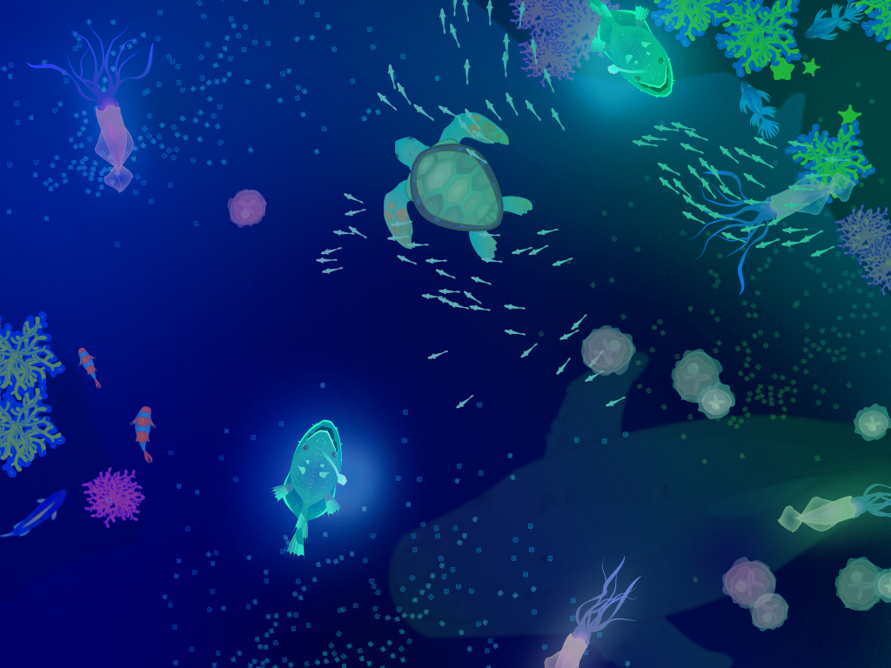

# Sandbox Ocean 2.0

## vision for new version
1. experience sandbox ocean on the web browser as chrome app
2. deep sea mode with various creatures

## user scenarios
1. install sandbox ocean chrome app.
2. read description and watch the demo video.
3. click try button then experience sandbox ocean on the browser
4. If user is ready make own sandbox ocean

### deep sea mode design

***
* ## Technical layout
  * ## chrome web app packaging
  * ## web view side
     * coffeescript
        * using for neat and clean coding
     * html5 - canvas
     * easl.js
        * using converted flash animation asset for easl.js
     * webgl(GLSL)
        * use webgl shader for fast pixel modification
     * socket.io
        * to connect socket with local server and transfer depth data
  * ## local server side
     * node.js
     * libfreenect
     * node png
     * kinect-depth
     * node static

