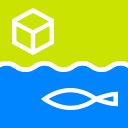

* ## Story board draft for new deep sea mode
	* features
		* There is no land area, so every creature(fish) can move freely.
		* Add group style move creatures.
		* camera will be zooming so every creatures will be big.
		* Vivid fluorescent color tone world.
		* sometimes very big creature like whale navigate the sandbox.
		* Add floking algorithm for creature move.

	* story board

	* sketch of creatures at deep see
	    * football fish and deep see squid
* 
	* design of creatures based on sketch
* 
***
* design image for chrome apps
	* Wire frame for chrome apps
		* after launch application user watch the video and documentations about this project and they play it on through it.
		* on non kinect version, we supply ui for mouse interaction. Using gui interface user can alternative experience.
		* If user install local server application file then connect kinect they can play with kinect.
		* There is also include manual of install sandbox ocean, user can use it as refrence.
* 
* 
	* design draft based on wire frame
* 
* 
***
## Logo / icon design
* we make a logo for project

* cover image for DevArt web page

* icon design for Chrome App
	* 128px 
	* 16px 