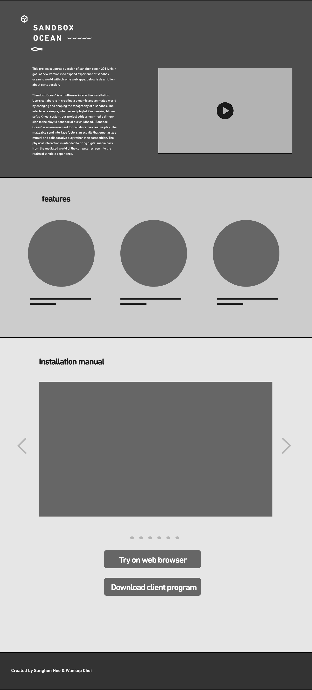
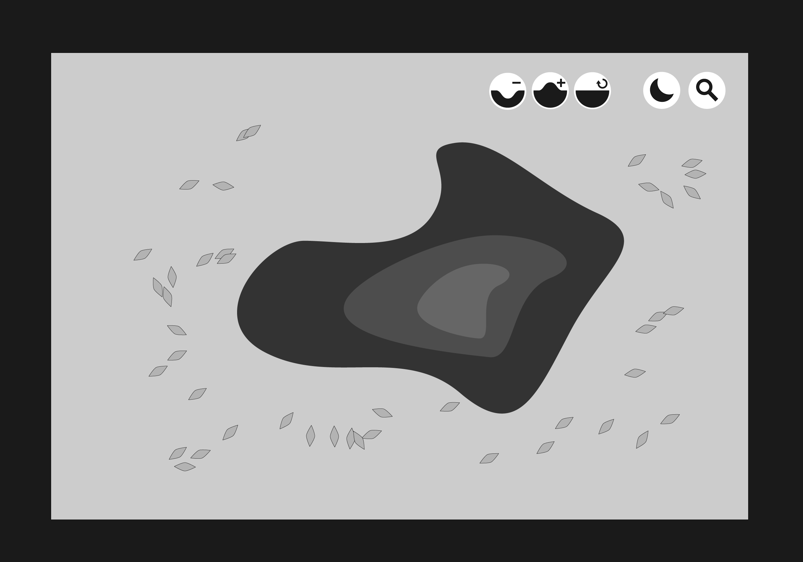

* 크롬앱 디자인
	* Wire frame for chrome apps
		* after launch application user watch the video and documentations about this project and they play it on through it.
		* on non kinect version, we supply ui for mouse interaction. Using gui interface user can alternative experience.
		* If user install local server application file then connect kinect they can play with kinect.
		* There is also include manual of install sandbox ocean, user can use it as refrence.
* 
* 
	* design draft based on wire frame
* 
* 

